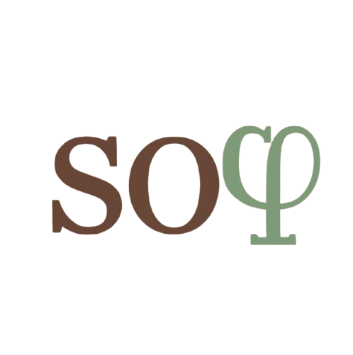

# \\(so\varphi\\): The Golden Ratio of Practice

  
   
  <em>Wisdom in Practice. Precision in Learning.</em>

---

**\\(so\varphi\\)** (pronounced *Sophie*), named after the Greek word for *wisdom*, is an intelligent, adaptive practice platform designed to bridge the gap between static course materials and personalized learning. In the high-stakes environment of university STEM courses, generic study tools often fail to capture the nuance of a professor's specific teaching style. Sophi solves this by ingesting course-specific "DNA"—syllabi, past exams, and notes—to generate an infinite stream of high-quality, stylistically accurate practice problems.

By employing **symbolic verification** (via Wolfram Alpha and RAG) and **contextual compression** (via The Token Company), Sophi eliminates the hallucinations common in LLMs while maintaining lightning-fast performance (sub 3 second question generation). It helps students achieve the "golden ratio of practice" (referencing $\varphi$): maximizing retention and understanding while minimizing the time spent on passive study.

## 🛠️ Tech Stack

### Core Architecture
*   **Frontend**:   
*   **Backend**:   

### AI & Data Infrastructure
*   **Reasoning Engine**: **Google Gemini Flash Lite 2.5** (optimized for low-latency reasoning).
*   **Truth Layer**: **Wolfram Alpha API** (for symbolic math verification and fact-checking).
*   **Context Optimization**: **The Token Company API** (compressing syllabus data by up to 60% without information loss).
*   **Vector Search**: **FAISS** (for retrieving relevant textbook citations).

## 💡 Inspiration: The "3 AM Problem"

In the futuristic landscape of "Turing City," access to information is unlimited, but access to *context* is scarce. We realized that while tools like ChatGPT are incredible at general knowledge, they fail miserably at **specifics**. They don't know that *your* Calculus professor emphasizes "epsilon-delta proofs" over "limit laws," or that *your* CS class uses a specific pseudo-code dialect.

This disconnect leads to the "3 AM Problem": You're studying for a midterm, you're stuck on a concept, and the generic internet explanations are confusing or irrelevant. Office hours are closed. You need a tutor who knows *your* class.

Sophi was born to be that tutor. We built it to solve three critical failures in modern education:
1.  **Resource Scarcity**: Most professors provide only 1-2 practice exams. Once you finish them, you're out of material.
2.  **The "Illusion of Competence"**: Students often re-read notes (passive study) instead of solving new problems (active recall), leading to a 20% drop in potential performance (Roediger & Karpicke, 2006).
3.  **Feedback Latency**: Waiting days for a grade prevents the "tight feedback loop" required for rapid skill acquisition. (Anderson, J. R., et al., 1995)
4.  **The "Spoiler Effect"**: When stuck, students often jump straight to the full solution (via Chegg or answer keys), bypassing the productive struggle essential for deep learning. This premature revelation robs them of the cognitive stimulation needed to form lasting neural pathways.

## 🚀 Key Features

### 1. The Class File ("Course DNA")
Sophi doesn't just "know math"; it knows *your* math class. By uploading PDFs of syllabi and past exams, Sophi constructs a **Class File**—a structured JSON representation of the course's scope, sequence, and difficulty.
*   *Extracts key concepts and terminology.*
*   *Maps the "unit" structure of the course.*
*   *Learns the specific phrasing style of the instructor.* - This is our most important feature, as it allows for targeted tuned practice.

### 2. Adaptive "Sessions"
Students don't just "practice"; they configure a **Session** based on their needs:
*   **Focus Mode**: Target specific weak units (e.g., "Unit 3: Derivatives").
*   **Cumulative Mode**: Interleaved practice across all previous units to boost retention.
*   **Difficulty Scaling & Adaptive Mode**: Scale that adjusts in real-time based on performance.

### 3. Hallucination-Free Math
One of the biggest risks of AI in STEM is "confident wrongness." Sophi mitigates this with a **Dual-Verification System**:
*   The LLM generates the *pedagogical* structure of the question.
*   **Wolfram Alpha** is queried to verify the *mathematical truth* of the answer and steps.
*   If the LLM's answer doesn't match the symbolic ground truth, the question is regenerated before the user ever sees it.

### 4. Progressive Hints & "Maximal Stimulation"
True learning happens during the struggle, not the solution. Sophi's hint system is designed to maximize **active recall** and cognitive stimulation:
*   **Tiered Assistance**: Hints don't just give the answer. They start with high-level *metacognitive* or *conceptual* nudges (e.g., "What implies continuity here?") and only descend to *procedural* steps if you're truly stuck.
*   **The "Golden Ratio"**: By withholding the full solution until necessary, Sophi keeps you in the zone of optimal development, so the challenge is just right to promote learning without causing frustration.
*   **Context-Aware**: Hints remember your previous attempts, ensuring you never get the same advice twice.

## 🏗️ How We Built It

The development of Sophi was a masterclass in system integration, built during a sleepless 24-hour sprint.

### The "Sophi AI" Pipeline
The heart of the project is `sophi_ai.py`, a complex orchestration layer that manages the conversation between the user, Gemini, and Wolfram.
1.  **Context Compression**: We use **The Token Company's API** to "prune" massive syllabus files. A 50-page PDF is compressed into its semantic essence, allowing us to fit entire course histories into the Gemini context window without blowing up latency or costs.
2.  **Robust JSON Repair**: LLMs are notorious for outputting malformed JSON. We built a custom "self-healing" parser that uses stack-based analysis to fix broken brackets and unescaped characters on the fly, ensuring the frontend never crashes due to a bad AI response.
3.  **Dynamic Prompting**: We don't use static prompts. The system dynamically assembles prompts based on the user's session history, injecting specific "focus concepts" and "style guides" from the Class File at runtime.

### Frontend Engineering
The frontend is built with **React** and **Framer Motion** to feel extremely fluid. We focused heavily on **Optimistic UI**—the interface predicts the next state to mask API latency, making the app feel instantaneous even when complex AI reasoning is happening in the background.

### Backend Engineering
The backend is a **Flask** API designed around low-latency, verifiable problem generation. It exposes endpoints for **Class File ingestion**, **session orchestration**, and **answer verification**, and acts as the control plane between Gemini, Wolfram Alpha, FAISS retrieval, and MongoDB persistence.

*   **PDF Ingestion & Course DNA Extraction**: Uploaded PDFs (syllabi, notes, exams) are parsed server-side, chunked, compressed, and converted into a structured *Class File* JSON that the frontend can browse and the AI pipeline can condition on.
*   **Session State & Persistence**: We store sessions, attempts, and performance signals in **MongoDB Atlas**, enabling adaptive difficulty, cumulative review, and “don’t repeat the same hint twice” behavior across devices.
*   **Retrieval-Augmented Generation (RAG)**: Relevant snippets (units, definitions, instructor phrasing, and optionally textbook references via FAISS) are retrieved per request to keep prompts grounded and stylistically consistent with the course.

## ⚔️ Competitive Analysis

| Feature | **Sophi** | Quizlet AI | Khanmigo | ChatGPT (Plus) |
| :--- | :---: | :---: | :---: | :---: |
| **Instructor Alignment** | ✅ (Deep) | ❌ | ❌ | ⚠️ (Surface) |
| **Symbolic Verification** | ✅ (Wolfram) | ❌ | ❌ | ⚠️ (Python) |
| **Adaptive Difficulty** | ✅ (Real-time) | ⚠️ (Tags) | ✅ | ❌ |
| **Hallucination Rate** | **< 2%** | High | Low | Medium |
| **Token Optimization** | ✅ (Compression) | ❌ | ❌ | ❌ |

## 🏆 Challenges & Accomplishments

*   **The "Context Window" War**: We initially hit token limits constantly when feeding full syllabi to the model. Integrating **The Token Company** was a turning point—it allowed us to reduce our prompt size by ~60%, making the app faster and cheaper. Additionally, The Token Company allowed our mathematical queries to be far less verbose, which helped reduce the hallucination rate.
*   **Taming the LLM**: Getting Gemini to output valid LaTeX *and* valid JSON simultaneously was a nightmare. We had to write a robust "sanitization layer" that strips markdown fences and escapes LaTeX backslashes before parsing.
*   **The "Wolfram Handshake"**: Mapping natural language questions to Wolfram Alpha queries is an art. We built a translation step where Gemini first converts the student's question into a "Wolfram-compliant query" string before we send it to the API.

## 🔮 What's Next

*   **LMS Integration**: Direct Canvas/Blackboard integration to auto-populate Class Files.
*   **Multimodal Input**: Snap a photo of a handwritten problem to get instant hints (already partially implemented in backend).
*   **Professor Dashboard**: A view for instructors to see where the class is struggling in aggregate.
*   **Progress Tracking**: Visualize student progress over time, identify areas of strength and weakness.
*   **Collaborative Practice**: Work together with friends to solve problems, share strategies, and track progress.

---

### 📚 Citations
*   **Roediger, H. L., & Karpicke, J. D. (2006).** *Test-enhanced learning: Taking memory tests improves long-term retention.* Psychological Science. [DOI](https://doi.org/10.1111/j.1467-9280.2006.01693.x)
*   **Anderson, J. R., et al. (1995).** *Cognitive tutors: Lessons learned.* The Journal of the Learning Sciences. [DOI](https://doi.org/10.1207/s15327809jls0402_2)
